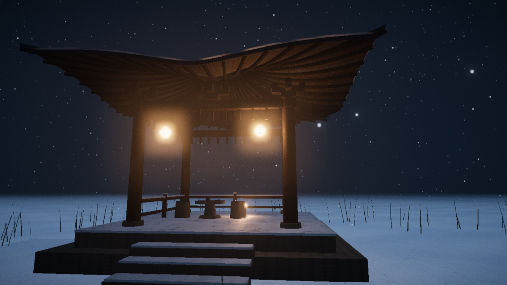
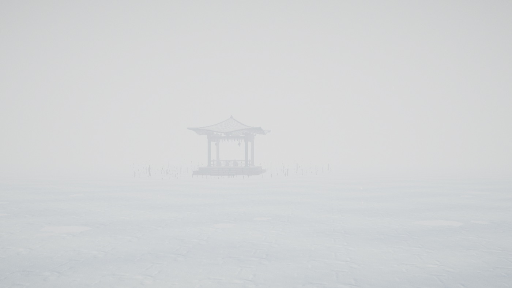
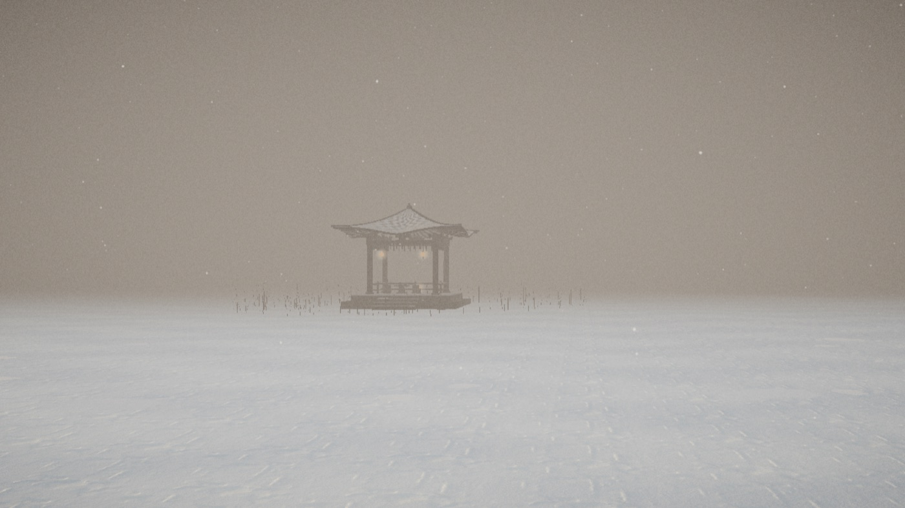
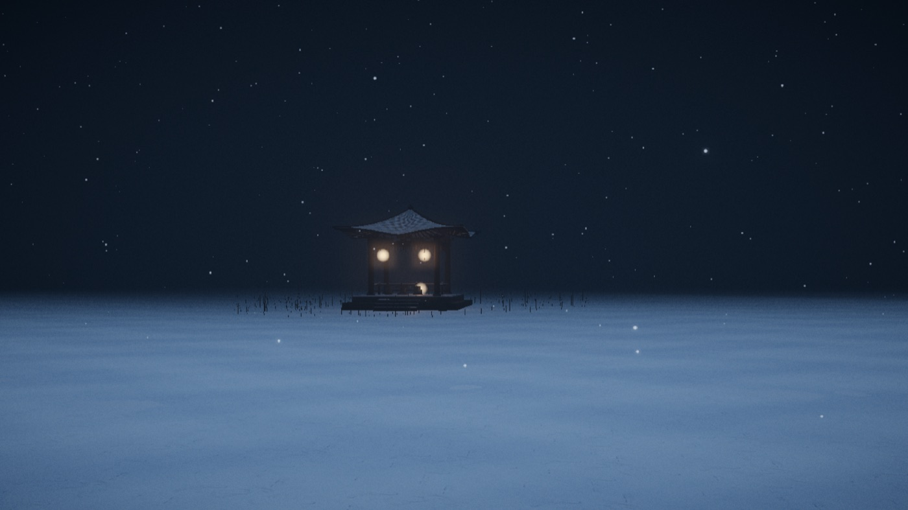

<div align="center">

# snow-pavilion

**惟长堤一痕、湖心亭一点、与余舟一芥、舟中人两三粒而已。**

<sub>—— 张岱《湖心亭看雪》，明崇祯五年（1632）</sub>

浏览器里可自由行走的雪湖亭台。
**每一个多边形都由方程生成。** 没有 3D 模型，没有 HDRI，没有构建步骤。

[English](README.md) · [架构文档](ARCHITECTURE.md) · [许可证](THIRD_PARTY.md)



</div>

---

## 这是什么

一篇四百年前的小品文，重建成可以走进去的实时 3D 场景。

崇祯五年十二月，张岱划一叶小舟到西湖心，看见整个世界被雪和雾削减成四个记号：
一痕长堤、一点亭子、一芥小舟、两三粒人。

**这种「削减」就是全部的设计纲领**——也恰恰是它能从一个 475 字节的 HTML 里跑到 60fps 的原因。

**5 个机位 × 3 个时辰**，或者切到自由行走，自己踏冰过湖。

| | | |
|:-:|:-:|:-:|
|  |  |  |
| 雪晨 | 暮雪 | 夜雪 |

## 跑起来

```bash
git clone https://github.com/syfssb/snow-pavilion
cd snow-pavilion
python3 -m http.server 8765
# 打开 http://localhost:8765/
```

不需要 `npm install`，不需要打包工具。three.js 已 vendored 在 `vendor/`，离线也能跑。
（必须走 http —— `file://` 会同时拦掉 ES 模块和贴图加载。）

**操作**：`1` `2` `3` 换时辰 · `[` `]` 上下机位 · `F` 自由行走 ·
`WASD` + `Shift` 移动 · 鼠标转视角。
深链接：`?t=night&c=steps&d=41`

## 为什么成立：雾就是 LOD

「上下一白」是美学要求。它同时**免费**提供了三样东西：

- **视距裁剪**。40 米外什么都不用画。不需要 LOD 分级、不需要流式加载、不需要远景几何体。
- **构图工具**。默认机位停在 41 米，是因为 `exp(-(0.0275 × 41)²) = 0.30`——
  亭子正好透 30%。再远就化没，再近就不叫**「一点」**了。
- **叙事机制**。走向亭子这件事**本身就是体验**，原文六个分句随距离缩短逐句浮现。

**美学要求和帧预算指向同一个方向。** 这在 3D 里很少见，也正是一篇 1632 年的散文
意外地成为绝佳 WebGL 场景规格书的原因。

## 屋顶就是三行方程

四角攒尖顶带飞檐，看起来非手工建模不可。其实不是：

```js
rEave  = W / max(|cos θ|, |sin θ|)            // 方形檐口
corner = (|cos θ| + |sin θ| - 1) / (√2 - 1)   // 0 = 面心，1 = 转角
zEave  = -H + lift · corner²                  // 檐角起翘
z      = zEave · (1 - (1-u)^2.2)              // 举折：脊部陡、近檐平
```

16 圈 × 80 段，`computeVertexNormals()`，完事。同一套思路造出了小舟（车削旋转体）、
900 根实例化枯苇、浮冰，以及整片湖面。

## 这个仓库里最有用的一件事

曾经连续四轮在加贴图细节、提高法线强度、把平整冰面换成位移几何体。**画面毫无变化。**

真因不是细节不够，是**过曝削顶**：雪的反照率约 0.9，配上半球光 1.75 + 方向光 1.85 +
环境贴图，地面亮度恒定超过 1.0。所有明暗变化在 tone mapping **之前**就被压平成纯白。

把光强砍掉一半，四轮看不见的工作一次性全部显形。

后来又抓到同一类的第二个 bug：胶片颗粒 `±0.0175` 被加在**线性 HDR** 上，
而暗部木作的线性值只有 `0.02` 量级——负半周直接钳到 0，再叠上 three.js 的
`RRTAndODTFit` 分子里那个 `−9.05e-5` 偏置，把 0 附近整段压死，
于是即使 lift 设成 `0.045`，仍然渲出**精确的 `(0,0,0)`**。
修法：`smoothstep(0, 0.11, luma)`——**胶片本来就是暗部无颗粒**。

**在加第一张贴图之前，先把曝光标定好。** 这句话写在 `ARCHITECTURE.md` 开头是有原因的。

## 目录

```
index.html          475 字节 —— importmap + 一行 module 标签
src/scene.js        几何与材质、程序化贴图
src/atmosphere.js   三套时辰，22 个参数 1.5 秒交叉淡入
src/cameras.js      预设构图、四元数 slerp、自由行走
src/ui.js           全部 DOM + CSS，自注入，零框架
src/main.js         装配 + 后处理链 + 主循环
vendor/             three.js r180，本地化（MIT）
tex/                Poly Haven 四套 PBR 贴图（CC0）
ARCHITECTURE.md     完整模块契约 —— 机位构图计算、三套光照参数表、模块边界
```

**用到的技术**：手写 `BufferGeometry` · `InstancedMesh` · 程序化 `CanvasTexture`
（雪地漫反射、涟漪法线、屋顶积雪 alpha、雪花 sprite）· 程序化 `CubeTexture` 天空环境 ·
`FogExp2` · `PCFSoftShadowMap` · `ACESFilmicToneMapping` ·
`EffectComposer` → `UnrealBloomPass` → 自写分级 `ShaderPass` → `OutputPass` ·
四元数 slerp 机位过渡。

**没用的**：任何建模软件、`GLTFLoader`、平面反射、烘焙 GI、React、打包器、CDN。

## 程序化生成的边界在哪

这个仓库想说明的只有一条规则：

> **能写成方程的，写代码。只能靠眼睛判断的，需要美术。**

亭子是按尺寸规范搭的模数化木构——它有方程。雪垄、涟漪、芦苇、车削的船身也有。

**刻意缺席的东西标出了另一边**：斗拱、雕花栏杆、彩绘梁枋、脊兽，
以及**「舟中人两三粒」**。人形没有方程，带穗的芦苇也没有。

已知短板（据实）：小舟没有接地阴影（方向光阴影视锥只有 ±22m，舟侧机位正在边缘）；
`≥45fps` 从未在真实硬件上验证过；触屏交互只用合成 PointerEvent 跑过。

## 致谢

基于 [three.js](https://threejs.org)（MIT）。贴图来自 [Poly Haven](https://polyhaven.com)（CC0）。
文本为张岱 1632 年所作，公有领域。详见 [THIRD_PARTY.md](THIRD_PARTY.md)。

MIT 许可。欢迎 fork——换个季节，把你自己的建筑放到湖心去。
